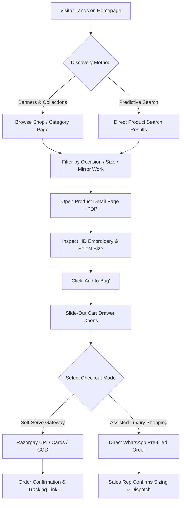

# Madamcutie — Design System & UI/UX Architecture Document

---

## 1. Design Philosophy & Aesthetic Identity

Madamcutie’s design language is termed **"Regal Contemporary"** — blending the heritage elegance of Old Delhi’s artisan embroidery with the sleek minimalism of modern international luxury fashion.

### Core Design Pillars
1. **Opulent Simplicity:** High-end typography and generous whitespace give product imagery room to breathe, avoiding visual clutter.
2. **Tactile Richness:** Micro-interactions (image scale zooms, gentle card lifts, shimmer button highlights, tactile size pills) mimic the feeling of luxury boutique shopping.
3. **Dual-Tone Contrast:** Deep noir charcoal (`#111111`) anchors the brand, balanced against metallic gold gradients (`#d4af37`), warm ivory linens (`#faf8f5`), and festive hot pink accents (`#ff007f`).
4. **Mobile-First Luxury:** 85%+ of Indian fashion shoppers browse via mobile devices; thumb-friendly tap targets, sticky add-to-cart bars, and smooth drawer transitions are prioritized.

---

## 2. Design Tokens & Design System Specification

### 2.1 Color Tokens

```css
:root {
    /* --- PRIMITIVE COLOR PALETTE --- */
    --color-noir:           #111111; /* Deepest Brand Charcoal / Black */
    --color-noir-soft:      #1a1a1a; /* Elevated dark surfaces / Cards */
    --color-gold-deep:      #b8860b; /* Dark bronze metallic stop */
    --color-gold-base:      #d4af37; /* Standard Regal Gold */
    --color-gold-light:     #f3e5ab; /* Champagne shimmer highlight */
    --color-gold-subtle:    #fdfaf3; /* Gold-tinted card background */
    --color-ivory-bg:       #faf8f5; /* Editorial section background */
    --color-pure-white:     #ffffff; /* Main surface white */
    --color-border-subtle:  #e8e3db; /* Warm hairline border */
    --color-text-primary:   #1f1f1f; /* High-contrast reading text */
    --color-text-secondary: #666666; /* Subtitles, breadcrumbs, hints */
    --color-text-muted:     #999999; /* Out of stock, placeholders */
    --color-pink-accent:    #ff007f; /* Urgency: Sale badges, heart active */
    --color-emerald:        #28a745; /* In-stock, Free Shipping, Success */
    --color-whatsapp:       #25d366; /* Official WhatsApp Brand Color */
    --color-whatsapp-hover: #20ba5c;

    /* --- BRAND GRADIENTS --- */
    --gradient-gold-metallic: linear-gradient(135deg, #b8860b 0%, #d4af37 35%, #f3e5ab 50%, #d4af37 65%, #b8860b 100%);
    --gradient-gold-text:     linear-gradient(45deg, #d4af37 0%, #f3e5ab 50%, #b8860b 100%);
    --gradient-hero-overlay:  linear-gradient(90deg, rgba(17,17,17,0.92) 0%, rgba(17,17,17,0.65) 45%, rgba(17,17,17,0.1) 100%);
    --gradient-hero-mobile:   linear-gradient(180deg, rgba(17,17,17,0.2) 0%, rgba(17,17,17,0.7) 60%, rgba(17,17,17,0.95) 100%);
    --gradient-instagram:     radial-gradient(circle at 30% 107%, #fdf497 0%, #fdf497 5%, #fd5949 45%, #d6249f 60%, #285aeb 90%);
}
```

---

### 2.2 Typography Scale & Hierarchy

- **Primary Heading Font:** `'Playfair Display', Georgia, serif`
- **Secondary Body & UI Font:** `'Plus Jakarta Sans', system-ui, -apple-system, sans-serif`

| Token | Family | Size | Weight | Line Height | Letter Spacing | Usage |
| :--- | :--- | :--- | :--- | :--- | :--- | :--- |
| `--font-display-hero` | Playfair Display | `clamp(36px, 5vw, 64px)` | 700 | 1.1 | `-0.5px` | Main Hero Headline |
| `--font-heading-1` | Playfair Display | `clamp(28px, 4vw, 44px)` | 600 | 1.2 | `0px` | Page Titles (Collections, About) |
| `--font-heading-2` | Playfair Display | `clamp(22px, 3vw, 32px)` | 500 | 1.25 | `0.5px` | Section Titles (Featured Looks) |
| `--font-heading-3` | Playfair Display | `clamp(18px, 2vw, 24px)` | 500 | 1.3 | `0.5px` | PDP Title, Drawer Headers |
| `--font-subtitle-eyebrow`| Plus Jakarta Sans| `11px - 12px` | 700 | 1.4 | `2.5px` | Uppercase Eyebrow, Badges |
| `--font-body-large` | Plus Jakarta Sans| `16px - 18px` | 400 | 1.7 | `0px` | Lead Paragraphs, Editorial Story |
| `--font-body-regular`| Plus Jakarta Sans| `14px - 15px` | 400 | 1.6 | `0px` | Product Descriptions, Specs |
| `--font-caption-small`| Plus Jakarta Sans| `12px - 13px` | 500 | 1.4 | `0.5px` | Reviews count, Form labels |
| `--font-price-bold` | Plus Jakarta Sans| `18px - 24px` | 700 | 1.2 | `0px` | Currency amounts (`₹1,499`) |

---

### 2.3 Spacing, Grid & Layout Tokens

```css
:root {
    /* 4px / 8px Grid System */
    --space-2xs: 4px;
    --space-xs:  8px;
    --space-sm:  12px;
    --space-md:  16px;
    --space-lg:  24px;
    --space-xl:  32px;
    --space-2xl: 48px;
    --space-3xl: 64px;
    --space-4xl: 96px;

    /* Responsive Clamp Spacing */
    --container-max: 1320px;
    --container-padding: clamp(16px, 4vw, 64px);
    --section-vertical:  clamp(48px, 8vw, 100px);

    /* Elevation & Shadows */
    --shadow-subtle: 0 2px 10px rgba(0, 0, 0, 0.04);
    --shadow-card:   0 6px 20px rgba(0, 0, 0, 0.08);
    --shadow-hover:  0 12px 32px rgba(0, 0, 0, 0.14);
    --shadow-drawer: -10px 0 40px rgba(0, 0, 0, 0.2);

    /* Border Radii */
    --radius-pill:   999px; /* Badges, size buttons */
    --radius-sm:     4px;   /* Buttons, inputs, small cards */
    --radius-md:     8px;   /* Product cards, modal dialogs */
    --radius-lg:     16px;  /* Mobile sheets, hero banners */
}
```

---

## 3. UI Component Specifications

### 3.1 Button Component Library

```
[ Primary Button ]      [ Secondary Button ]     [ WhatsApp Button ]      [ Quick Add Button ]
┌────────────────────┐  ┌────────────────────┐  ┌─────────────────────┐  ┌──────────────────┐
│   ADD TO BAG       │  │    OUR STORY       │  │ ✆ ORDER ON WHATSAPP │  │  QUICK ADD [+]   │
└────────────────────┘  └────────────────────┘  └─────────────────────┘  └──────────────────┘
  Bg: #111111             Bg: Transparent         Bg: #25D366 (Green)      Bg: rgba(0,0,0,0.85)
  Color: #FFFFFF          Border: 1.5px #111      Color: #FFFFFF           Color: #FFFFFF
  Hover: Gold #d4af37     Hover: Inverse #111     Hover: #20BA5C           Slide-up on Card Hover
```

- **States:**
  - `Default`: Uppercase, bold, 11px - 14px, letter-spacing `0.15em`, padding `14px 28px`.
  - `Hover`: Transition `transform: translateY(-2px)`, shadow elevation.
  - `Active/Pressed`: `transform: scale(0.98)`.
  - `Loading/Adding`: Shows inline spinning SVG indicator.
  - `Added (Success)`: Background transitions to `#ff007f` or `#28a745` with checkmark icon `✓ Added`.

---

### 3.2 Product Card (Catalog Molecule)

```
┌────────────────────────────────────────┐
│ [SALE]                       [♥ Heart] │
│                                        │
│                                        │
│          3:4 PORTRAIT IMAGE            │
│         (Hover: 1.08x Zoom &           │
│          Alternate Angle Swap)         │
│                                        │
│                                        │
│ ┌────────────────────────────────────┐ │
│ │          + QUICK ADD               │ │  <-- Appears on hover
│ └────────────────────────────────────┘ │
├────────────────────────────────────────┤
│ MADAMCUTIE LUXURY                      │  <-- Eyebrow (10px, Gold)
│ Vibrant Mirror-Work Corset Blouse      │  <-- Title (15px, 2-line clamp)
│ ★★★★★ (48)                             │  <-- Star ratings (Gold)
│ ₹1,499  ~~₹2,199~~ (32% OFF)           │  <-- Price + Discount
└────────────────────────────────────────┘
```

---

### 3.3 Size Selector & Measurement Component (PDP)
- **Visual:** Horizontal flex row of pills: `XS (32)` | `S (34)` | `M (36)` | `L (38)` | `XL (40)` | `Custom`.
- **States:**
  - `Unselected`: White background, 1px border `#ddd`, text `#111`.
  - `Selected`: Black background (`#111`), white text, gold border glow.
  - `Out of Stock`: Strikethrough line across pill, opacity 0.4, cursor disabled.
- **Size Chart Drawer/Modal:**
  - Tab 1: **Inches** | Tab 2: **Centimeters**.
  - Diagram illustrating: (A) Bust measurement, (B) Underbust / Waist, (C) Front Length, (D) Armhole.
  - Measurement tips: "Measure around the fullest part of your bust while wearing the innerwear you intend to wear with this blouse."

---

### 3.4 Cart Drawer (Slide-Over Organism)

```
┌────────────────────────────────────────────────────────────┐
│ YOUR SHOPPING BAG (3 ITEMS)                            [✕] │
├────────────────────────────────────────────────────────────┤
│ ✦ Add ₹751 more to qualify for FREE COMPLIMENTARY SHIPPING  │
│ [████████████████████░░░░░░░░░░] 66%                       │
├────────────────────────────────────────────────────────────┤
│ ┌────────┐  Vibrant Handcrafted Mirror Corset              │
│ │  IMG   │  Size: M (36") | Color: Emerald                 │
│ │  3:4   │  [-]  1  [+]                    ₹1,499   [Trash]│
│ └────────┘                                                 │
│ ┌────────┐  Black Beaded Sweetheart Bustier                │
│ │  IMG   │  Size: S (34") | Color: Noir                    │
│ │  3:4   │  [-]  1  [+]                    ₹1,999   [Trash]│
│ └────────┘                                                 │
├────────────────────────────────────────────────────────────┤
│ Subtotal:                                           ₹3,498 │
│ Shipping:                                             FREE │
│ Est. Taxes (GST 5% Included):                         ₹166 │
│ Total:                                              ₹3,498 │
├────────────────────────────────────────────────────────────┤
│ [   PROCEED TO CHECKOUT (UPI / CARDS / COD)   ]            │
│ [   ✆ CHAT & ORDER ON WHATSAPP               ]            │
│                                                            │
│ 🔒 100% Secure Checkout | Free 2-Day Easy Returns           │
└────────────────────────────────────────────────────────────┘
```

---

## 4. User Journey & Interaction Wireflows

### 4.1 Primary Purchase Journey



---

## 5. Responsive Breakpoint Strategy

| Screen Class | Viewport Range | Grid Columns | Navigation Pattern | Touch Target |
| :--- | :--- | :--- | :--- | :--- |
| **Mobile Small** | `320px - 380px` | 1 col (Hero) / 2 col (Cards) | Slide Drawer (`width: 85%`) | Min `48px x 48px` |
| **Mobile Large** | `381px - 599px` | 2 columns (tight 12px gap) | Slide Drawer + Sticky Add-to-Cart | Min `48px x 48px` |
| **Tablet Portrait**| `600px - 899px` | 2 - 3 columns | Hamburger Menu + Header Actions | Min `44px x 44px` |
| **Tablet Landscape**| `900px - 1199px`| 3 columns | Horizontal Nav Bar + Search Bar | Min `44px x 44px` |
| **Desktop High-Res**| `1200px - 1920px`| 4 columns (`gap: 30px`) | Full Mega-Menu / Full Header | Min `40px x 40px` |

---

## 6. Micro-Interactions & Animation Guide
- **Page Load:** Subtle fade-in (`opacity: 0 -> 1`, `300ms ease-out`).
- **Product Card Hover:**
  - Card translateY: `-6px`.
  - Box shadow: `0 12px 30px rgba(0,0,0,0.12)`.
  - Image scale: `transform: scale(1.06)`, `transition: transform 0.6s cubic-bezier(0.165, 0.84, 0.44, 1)`.
- **Drawer Slide:** `cubic-bezier(0.25, 1, 0.5, 1)` easing for a snappy, native iOS/Android sheet sensation.
- **Heart Wishlist Tap:** Pulse keyframe animation `scale(1) -> scale(1.3) -> scale(1)`.
